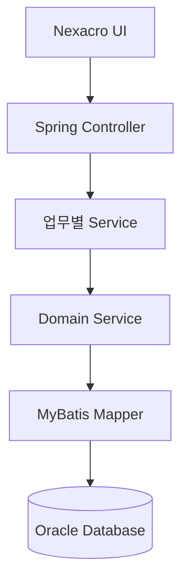
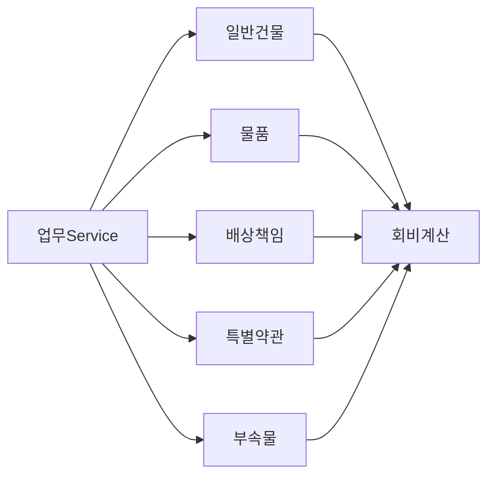

# 시스템 아키텍처

## 시스템 개요

NGMA 교육시설공제 업무 시스템은 학교별 공제 가입 및 회비 산정을 처리하는 업무 시스템이다.

주요 기능:

- 가입 업무 관리
- 건물/물품/부속물 정보 관리
- 공제 회비 계산
- 특약 및 배상책임 관리
- 가입 데이터 검증 및 저장

업무 로직은 Domain 단위로 분리하여 계산 정책 변경에 유연하게 대응하도록 구성한다.

---

## 전체 구조도



---

## 도메인 아키텍처



---

## 패키지 구조 (Package Structure)

시스템의 가독성과 유지보수성을 위해 계층형(Layered) 및 도메인(Domain) 기반 구조를 혼합하여 구성합니다.

```text

com.ngma.app
├── global                     # 공통 모듈 (Security, Exception, Utility, Config 등)
│   ├── config
│   ├── exception
│   └── util
│
├── bldg                   # [도메인] 일반건물
│   ├── service            # 업무 흐름 제어 및 트랜잭션 관리
│   ├── serviceImpl        # 순수 비즈니스/계산 로직 (Domain Service, Policy)
|   ├── dto                # 화면에 받아올 parameter 설정
│   └── mapper             # DB 접근 인터페이스 (MyBatis Mapper)
│
├── cmdty                  # [도메인] 물품
├── adjt                   # [도메인] 부속물
├── cmpns                  # [도메인] 배상책임
├── spclt                  # [도메인] 특별약관
│
└── PMSCOMService          # [업무공통] 공통 조회 및 데이터 후처리
```

---

## 설계 원칙

### Domain 분리

건물, 물품, 부속물 등 업무 영역별 계산 책임을 분리한다.

- [건물](Domain/Building.md)
- [배상책임](Domain/Cmpns.md)
- [부속물](Domain/Adjt.md)
- [물품](Domain/Cmdty.md)
- [지진복구지원](Domain/Eaqk.md)
- [물품포괄](Domain/CmdtyInclv.md)
- [전기위험](Domain/Erisk.md)


### Service 역할

Service는 업무 흐름을 관리하고 상세 계산은 Domain Service가 담당한다.

### SQL 책임 분리

Mapper는 데이터 조회 및 저장 역할만 담당한다.

### 확장성 고려

연도별 약관 변경 시 기존 로직 영향을 최소화한다.