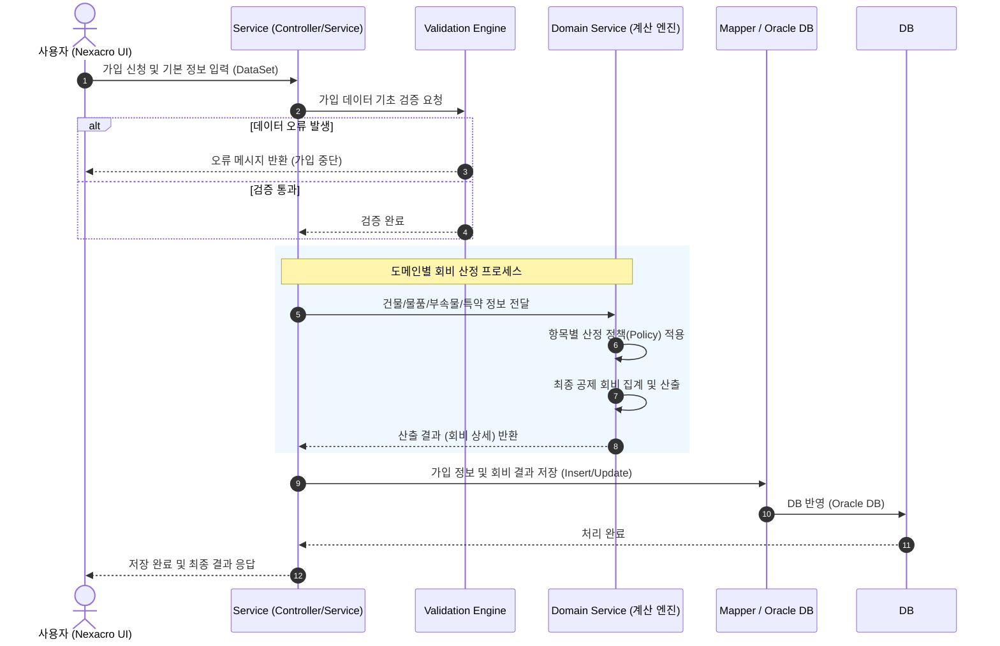

## 비즈니스 플로우 (Business Flow)

본 시스템의 가입 신청부터 회비 산정, 데이터 저장까지의 전체 처리 흐름은 아래와 같습니다.

---

```mermaid
sequenceDiagram
    autonumber
    actor User as 사용자 (Nexacro UI)
    participant C as Service (Controller/Service)
    participant V as Validation Engine
    participant D as Domain Service (계산 엔진)
    participant M as Mapper / Oracle DB

    User->>C: 가입 신청 및 기본 정보 입력 (DataSet)
    C->>V: 가입 데이터 기초 검증 요청
    
    alt 데이터 오류 발생
        V-->>User: 오류 메시지 반환 (가입 중단)
    else 검증 통과
        V-->>C: 검증 완료
    end

    rect rgb(240, 248, 255)
        note over C,D: 도메인별 회비 산정 프로세스
        C->>D: 건물/물품/부속물/특약 정보 전달
        D->>D: 항목별 산정 정책(Policy) 적용
        D->>D: 최종 공제 회비 집계 및 산출
        D-->>C: 산출 결과 (회비 상세) 반환
    end

    C->>M: 가입 정보 및 회비 결과 저장 (Insert/Update)
    M->>DB: DB 반영 (Oracle DB)
    DB-->>C: 처리 완료
    C-->>User: 저장 완료 및 최종 결과 응답
```    