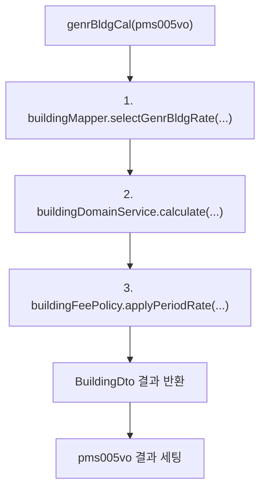
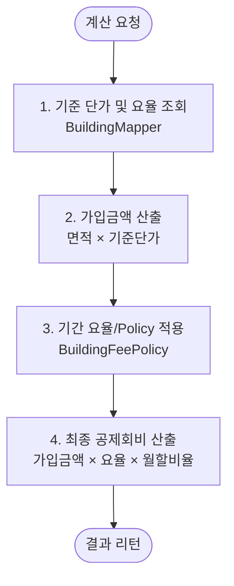

# 일반건물 계산 (Building Fee Calculation)

일반건물 도메인은 학교 건물 개별 단위의 면적, 가입 기간, 적용 요율을 바탕으로 **가입금액** 및 **최종 공제회비**를 산정합니다.

---

## 1. 구성 요소 (Components)

| 구분 | 클래스/파일명 | 역할 및 기능 |
| :--- | :--- | :--- |
| **Service** | `BuildingService` | 가입 요청 수신, 도메인 계산 호출, 결과 반환 |
| **Domain** | `BuildingServiceImpl` | 건물 회비/가입금액 산정 및 연도별 Policy 적용 |
| **Mapper** | `BuildingMapper` | 건물 기준 단가 조회 및 산출 결과 저장 |
| **DTO** | `BuildingDto` | 건물 계산 입/출력 데이터 전송 객체 |

---

## 1-1. 주요 메서드 및 호출 흐름 (Method Execution Flow)

요청 처리 과정에서 각 레이어별 메서드가 실행되는 연쇄 구조입니다.



---


## 2. 입·출력 데이터 사양 (Data Specification)

### 입력 (Input)

| 항목 (Property) | 설명 | 데이터 타입 | 비고 / 예시 |
| :--- | :--- | :--- | :--- |
| `joinYr` | 가입년도 | `String` | YYYY (예: `"2026"`) |
| `genrBldgJoinArea` | 건축면적 (㎡) | `BigDecimal` | 예: `1500.50` |
| `siBldgUsgSeCd` | 건물보유구분 | `String` | 예: 건물보유구분코드(`"101"`) |
| `muaJoinBgngMm` | 가입 시작월 | `String` | MM (예: `"01"`) |
| `muaJoinEndMm` | 가입 종료월 | `String` | MM (예: `"12"`) |


### 출력 (Output)

| 항목 (Property) | 설명 | 데이터 타입 | 산출 방식 |
| :--- | :--- | :--- | :--- |
| `genrBldgJoinAmt` | 가입금액 | `BigDecimal` | 면적 × 연도별 지급한도액 |
| `genrBldgMuaMbfeeAmt` | 공제회비 | `BigDecimal` | 면적 x 연도별 기준단가 × (기본 요율 - 환급요율 / 100)|

---

## 3. 계산 흐름 및 정책 (Calculation Flow & Policy)



## 4. 참조 SQL

```SQL

SELECT BASE_UNIT_PRICE
  FROM TB_BLDG_FEE_RATE
 WHERE JOIN_YR = #{joinYr}
   AND USE_YN  = 'Y'

```