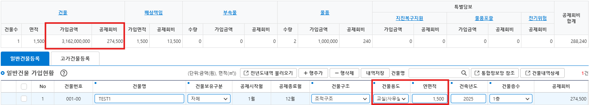

# 일반건물

## 개요

일반건물의 가입정보를 바탕으로 **가입금액** 및 **최종 공제회비**를 산정합니다.

---

## 일반건물 계산 Method

| 클래스/파일명 | 메소드명 | 입력 타입 | 출력 타입 |
| :--- | :--- | :--- | :--- |
| `BuildingServiceImpl` | `genrBldgCal` | `Map<String, Object>` | `BuildingDto` |

### 입력 (Input)

| 항목 (Property) | 설명 | 데이터 타입 | 비고 / 예시 |
| :--- | :--- | :--- | :--- |
| `joinYr` | 가입년도 | `String` | YYYY (예: `"2026"`) |
| `genrBldgJoinArea` | 건축면적 (㎡) | `BigDecimal` | 예: `1500.50` |
| `siBldgUsgSeCd` | 건물보유구분 | `String` | 예: 건물보유구분코드(`"101"`) |
| `muaJoinBgngMm` | 가입 시작월 | `String` | MM (예: `"01"`) |
| `muaJoinEndMm` | 가입 종료월 | `String` | MM (예: `"12"`) |

### 출력 (Output)

| 항목 (Property) | 설명 | 데이터 타입 | 산출 방식 |
| :--- | :--- | :--- | :--- |
| `genrBldgJoinAmt` | 가입금액 | `BigDecimal` | 면적 × 연도별 지급한도액 |
| `genrBldgMuaMbfeeAmt` | 공제회비 | `BigDecimal` | 면적 x 연도별 기준단가 × (기본 요율 - 환급요율 / 100)|

---

### 📸 화면 기준 산출 예시 (Example)



> **[예시 시나리오]**<br>
> • **건축면적(`genrBldgJoinArea`):** `1,500` ㎡<br>
> • **건물보유구분(`siBldgUsgSeCd`):** `"101"` (교실(사무실) 지급한도금액(2026년기준): **2,108,000원**)<br>
> • **가입 기간:** 1월 ~ 12월 (12개월 / 환급요율 0% 가정)

* **가입금액 산출:** `1,500` (면적) × `2,108,000` (연도별 지급한도액) = **`3,162,000,000` 원**
* **공제회비 산출:** `1,500` (면적) × `183` (기준단가) = **`274,500` 원**


## 참조 SQL

```SQL
/*연도별 지급한도금액*/
SELECT give_lmit_amt
  FROM TB_MA_DSST_RCOST_GIVE_LMIT_AMT_I
 WHERE substr(aplcn_bgng_dte,1,4)=#{joinYr}
   AND mas_no = '1'
   AND si_bldg_usg_se_cd = #{siBldgUsgSeCd}

/*연도별 월가입요율 및 단가조회*/
SELECT bsc_untprc, mua_frt1, mua_frt2 ...
  FROM TB_MA_GENR_BLDG_MUA_FRT_I
 WHERE substr(aplcn_bgng_dte,1,4)=#{joinYr}
   AND mas_no = '1'

/*연도별 월환급요율 및 단가조회*/
SELECT bsc_untprc, rmbr_frt1, rmbr_frt2 ...
  FROM TB_MA_GENR_BLDG_RMBR_FRT_I
 WHERE substr(aplcn_bgng_dte,1,4)=#{joinYr}
   AND mas_no = '1'


```