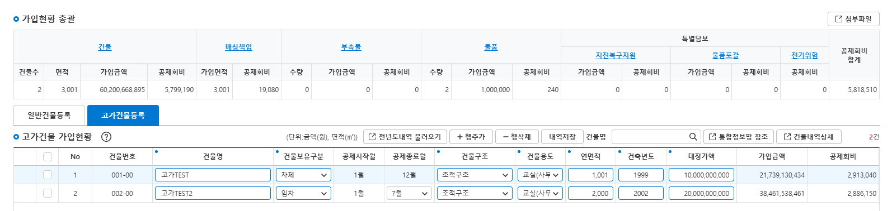

# 배상책임

배상책임 도메인은 학교 [건물](/Domain/Building/) 등록 뒤, 총 면적, 가입 유형, 가입 기간, 적용 요율을 바탕으로 **배상책임공제회비** 및 **특수약관적용공제회비**를 산정하고, 배상책임 테이블에 입력될 컬럼 정보들을 조회 후 저장합니다.

---

## 1. 구성 요소 (Components)

| 구분 | 클래스/파일명 | 역할 및 기능 |
| :--- | :--- | :--- |
| **Service** | `CmpnsService` | 가입 요청 수신, 도메인 계산 호출 |
| **Domain** | `CmpnsServiceImpl` | 배상책임 회비 산정 및 연도별 정책 적용 |
| **Mapper** | `CmpnsMapper` | 배상책임 회비 산출 결과 저장 |

---

## 2. 배상책임 회비 후처리 Method

| 클래스/파일명 | 메소드명 | 입력 타입 | 출력 타입 |
| :--- | :--- | :--- | :--- |
| `CmpnsService` | `sync` | `PMSCOMVO(기본정보)`, `muaJoinInfo(가입 후 필요정보)` | `void(없음)` |

> 📌 **호출 시점:** 건물 등록 직후, 서비스 내부에서 자동으로 실행되는 후처리 메소드입니다.

### 입력 (Input)

| 항목 (Property) | 설명 | 데이터 타입 | 비고 / 예시 |
| :--- | :--- | :--- | :--- |
| `joinYr` | 가입년도 | `String` | YYYY (예: `"2026"`) |
| `mbrNo` | 회원번호 | `String` | 예: `M0000` |
| `muaJoinSqno` | 공제가입순번 | `Integer` | 회원의 공제가입순번(예:`1`) |
| `schlJoinSqno` | 학교가입순번 | `Integer` |  학교의 공제가입순번(예:`1`) |
| `schlNo` | 학교번호 | `String` | 예: `S00000` |

### 출력 (Output)

* **N/A (반환값 없음)** — DB 처리(CRUD)만 수행 후 종료됩니다.

### 💡 주요 계산 정책 (Business Rules)

* **12월 17일 이후 가입 건 공제회비 감면**
  * 가입일자(`joinDte`)가 **12월 17일 이후**인 경우, 산출된 최종 공제회비의 **50%를 적용 (산출금액 × 0.5)**합니다.

---

## ⚙️상태 판단 및 분기 (CRUD 조건)

학교의 [건물](/Domain/Building/) 등록 이후, 가입 정보를 바탕으로 **배상책임 데이터(`TB_MS_CMPNS_RSPN_JOIN_D` 등)를 자동 CRUD** 처리하고 종료합니다.

   - **건물이 있으나 배상책임 내역이 없을 경우 (INSERT):** 신규 공제 가입 조건에 맞춰 데이터 신규 생성
   - **기존 배상책임 정보가 존재하고 건물도 존재하는 경우 (UPDATE):** 면적/조건 변경에 따라 배상책임 회비 재계산 및 갱신
   - **등록된 건물이 없는 경우 (DELETE):** 기존 배상책임 데이터 삭제 또는 미가입 처리
---

### 📸 화면 기준 산출 예시 (Example)



> **[예시 시나리오]**<br>
> • **건물 총 면적 :** `3,001` ㎡<br>
> • **가입 기간:** 1월 ~ 12월 -> `1,001 ㎡` <br> 1월 ~ 7월  -> `2,000 ㎡`

* **1번 건물:** `1,001`(면적) × `9`(기준단가) x `1`(100(1월가입율) - 0(12월환급율) / 100) = **`9,009` 원**
* **2번 건물:** `2,000`(면적) x `9`(기준단가) x `0.56`(100(1월가입율) - 44(7월환급율) / 100) = **`10,080` 원**
* **공제회비 산출:** `10,080` 원 + `9,009` 원 = **`19,080` 원(원 단위 절사)**


## 참조 SQL

```SQL

/*연도별 월가입요율 조회*/
SELECT  mua_frt1, mua_frt2 ...
  FROM TB_MA_CMPNS_RSPN_MUA_FRT_I
 WHERE substr(aplcn_bgng_dte,1,4)=#{joinYr}
   AND mas_no = '1'

/*연도별 월환급요율 조회*/
SELECT rmbr_frt1, rmbr_frt2 ...
  FROM TB_MA_CMPNS_RSPN_RMBR_FRT_I
 WHERE substr(aplcn_bgng_dte,1,4)=#{joinYr}
   AND mas_no = '1'

/*연도별 배상책임 단가 금액*/
SELECT BSC_UNTPRC, ITPSN_BSC_UNTPRC, OBJTV_BSC_UNTPRC --기본단가, 대인기본단가, 대물기본단가
  FROM TB_MA_CMPNS_RSPN_BSC_UNTPRC_I
 WHERE substr(aplcn_bgng_dte,1,4)=#{joinYr}
   AND mas_no = '1'

/*연도별 배상책임 대인배상인상계수정보 금액*/
SELECT BILB_CFCT_RT --대인배상계수비율
  FROM TB_MA_BILB_INCRE_CFCT_I
 WHERE substr(aplcn_bgng_dte,1,4)=#{joinYr}
   AND mas_no = '1'

/*연도별 배상책임 대물배상인상계수정보 금액*/
SELECT PDL_CFCT_RT --대물배상계수비율
  FROM TB_MA_PDL_INCRE_CFCT_I
 WHERE substr(aplcn_bgng_dte,1,4)=#{joinYr}
   AND mas_no = '1'

/*연도별 배상책임 특별약관배상단가정보 금액*/
SELECT ELVT_ACDNT_UNTPRC, PRSH_CDINS_MRGE_UNTPRC --승강기사고단가, 교직원자동차손해보험담보단가
  FROM TB_MA_SPCL_TRMS_CMPNS_UNTPRC_I
 WHERE substr(aplcn_bgng_dte,1,4)=#{joinYr}
   AND mas_no = '1'

```