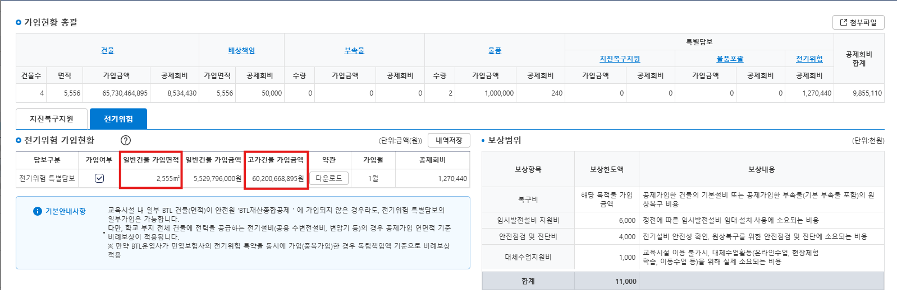

# 전기위험

전기위험 도메인은 학교 [건물](/Domain/Building/) 등록 뒤 일반건물의 가입면적, 고가건물의 가입금액을 바탕으로 **전기위험공제회비**를 산정하고, 전기위험 테이블에 입력될 컬럼 정보들을 조회 후 저장합니다.

---

## 1. 구성 요소 (Components)

| 구분 | 클래스/파일명 | 역할 및 기능 |
| :--- | :--- | :--- |
| **Service** | `EriskService` | 가입 요청 수신, 도메인 계산 호출, 결과 반환 |
| **Domain** | `EriskServiceImpl` | 전기위험 회비/가입금액 산정 적용 |
| **Mapper** | `EriskMapper` | 일반건물 면적, 고가건물 가입금액 기반으로 전기위험 회비 산출 결과 저장 |

---

## 2. 배상책임 회비 후처리 Method

| 클래스/파일명 | 메소드명 | 입력 타입 | 출력 타입 |
| :--- | :--- | :--- | :--- |
| `EriskService` | `sync` | `PMSCOMVO(기본정보)`, `muaJoinInfo(가입 후 필요정보)` | `void(없음)` |

> 📌 **호출 시점:** 건물 등록 직후, 서비스 내부에서 자동으로 실행되는 후처리 메소드입니다.

### 입력 (Input)

| 항목 (Property) | 설명 | 데이터 타입 | 비고 / 예시 |
| :--- | :--- | :--- | :--- |
| `joinYr` | 가입년도 | `String` | YYYY (예: `"2026"`) |
| `mbrNo` | 회원번호 | `String` | 예: `M0000` |
| `muaJoinSqno` | 공제가입순번 | `Integer` | 회원의 공제가입순번(예:`1`) |
| `schlJoinSqno` | 학교가입순번 | `Integer` |  학교의 공제가입순번(예:`1`) |
| `schlNo` | 학교번호 | `String` | 예: `S00000` |

### 출력 (Output)

* **N/A (반환값 없음)** — DB 처리(CRUD)만 수행 후 종료됩니다.

### 💡 주요 계산 정책 (Business Rules)

* **12월 17일 이후 가입 건 공제회비 감면**
  * 가입일자(`joinDte`)가 **12월 17일 이후**인 경우, 산출된 최종 공제회비의 **50%를 적용 (산출금액 × 0.5)**합니다.

---

## ⚙️상태 판단 및 분기 (CRUD 조건)

학교의 [건물](/Domain/Building/) 등록 이후, 가입 정보를 바탕으로 전기위험 특약이 가입되어있는 경우, **전기위험 데이터(`TB_MS_ERISK_MUA_JOIN_D` 등)를 자동 CRUD** 처리하고 종료합니다.

   - **건물이 모두 삭제되어, 건물면적이 0이 된 경우(DELETE):** 기존 전기위험 특약 데이터 삭제
   - **해당 회차가 전기위험특약을 가입한 첫번째 회차인 경우(UPDATE) :** 이전 회차의 모든 건물정보까지 조회하여 전기위험 회비 산출(Ex.추가가입 3차에서 전기위험을 최초가입하고 건물등록 후 후처리하면 정기가입, 추가가입 1,2차의 모든 건물정보를 통합하여 전기위험 회비 산출)
   - **해당 회차가 전기위험특약의 최초 가입회차가 아닌 경우(UPDATE):** 해당 회차의 건물정보로만 전기위험 회비 산출
---

### 📸 화면 기준 산출 예시 (Example)



> **[예시 시나리오]**<br>
> • **일반건물 총 면적 :** `2,555` ㎡<br>
> • **고가건물 총 가입금액 :** `60,200,668,895` 원<br>
> • **가입 기간:** 1월 ~ 12월 (12개월 / 환급요율 0% 가정)

* **일반 건물:** `2,555`(면적) × `26`(일반건물단가) = **`66,430` 원**
* **고가 건물:** `60,200,668,895`(면적) x (`0.002`(고가건물요율) / 100) = **`1,204,013.3779` 원**
* **공제회비 산출:** `66,430` 원 + `1,204,013.3779` 원 = **`1,270,443.3779` 원 -> 원단위 절사`1,270,440` 원**


## 참조 SQL

```SQL

/*연도별 건물단가 및 월가입요율 조회*/
SELECT GENR_BLDG_UNTPRC, HIPRC_BLDG_FRT, mua_frt1, mua_frt2 ...
  FROM TB_MA_ELCTY_MUA_FRT_I
 WHERE substr(aplcn_bgng_dte,1,4)=#{joinYr}
   AND mas_no = '1'

/*연도별 건물단가 및 월환급요율 조회*/
SELECT GENR_BLDG_UNTPRC, HIPRC_BLDG_FRT, rmbr_frt1, rmbr_frt2 ...
  FROM TB_MA_ELCTY_RMBR_FRT_I
 WHERE substr(aplcn_bgng_dte,1,4)=#{joinYr}
   AND mas_no = '1'

```